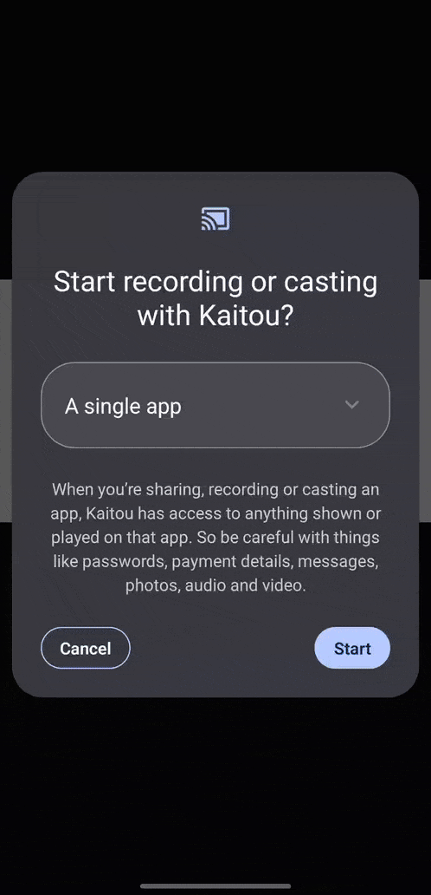

# Kaitou


[](https://github.com/farhannz/Kaitou/actions/workflows/build-ci.yml)

### Overview

***Kaitou*** is an app that utilizes optical character recognition (OCR) to assist users with Japanese media (manga,
games, etc.). It
extracts Japanese text from images and provides assistant tools to aid comprehension, all without requiring internet
connectivity.

> ⚠️ **Work in Progress**: Kaitou is a learning project made as an effort into learning Android development and
> Japanese.
> It's not a polished app—please expect rough edges, bugs, and unfinished features.

### Getting Started

> Download the apk from latest successful nightly
> build [from here](https://github.com/farhannz/Kaitou/releases/download/nightly-release/kaitou-release-nightly.apk).

1. Install the APK.
2. Open Kaitou and grant the required permissions:

    * **Display over other apps**
    * **Screen capture**
3. The floating button will appear and stay active until the app is exited.

### Who It’s For

* Japanese learners encountering unfamiliar words
* Readers of manga, games, web pages, or any other Japanese media

### Key Features

* Works across all apps—Chrome, manga, games, etc.
* 100% offline: all processing happens locally on your device

### Basic Flow

1. Launch the app once.
2. A small floating button appears on the right edge of your screen.
3. Tap the button to take a screenshot.
4. Japanese words in the image are automatically detected and outlined.
5. Tap any outlined word to view:
    * The word in kanji/kana
    * Its reading
    * An English definition
6. Swipe down or tap outside the overlay to close it. The button remains available for future captures.

Notes:
> To close the app, long press the floating button and tap shutdown

### Demo


> Demo content shown is for illustrative purposes only.

### Usage Tips

* Drag the floating button to a convenient spot on your screen.
* Long-press the button to open a quick menu (hide, settings, exit).
* If no text is detected, try zooming in or increasing screen brightness.

### Troubleshooting

* **Button not showing?** Make sure “Display over other apps” is enabled.
* **No text detected?** Try zooming into the source or enhancing brightness.

---

### For Developers & Contributors

Pull requests are welcome. For major changes, please open an issue first to discuss what you would like to change.

#### Building Kaitou

1. Clone the repository:

   ```bash
   git clone https://github.com/farhannz/kaitou.git
   ```

2. ```bash
   ./gradlew assembleDebug
   ```

#### Contributions

* Fork the repo and create a new branch for your changes.
* Keep commits clean and descriptive.
* Submit a pull request with a clear explanation of the change.

### Data & Privacy

* No data or images leave your device—everything stays local.
* All dictionary and processing data is stored offline.

### License

This project’s **code** is licensed under the [Apache License 2.0](LICENSE).  
Please note that **demo images and third-party content** are not covered by this license.

---